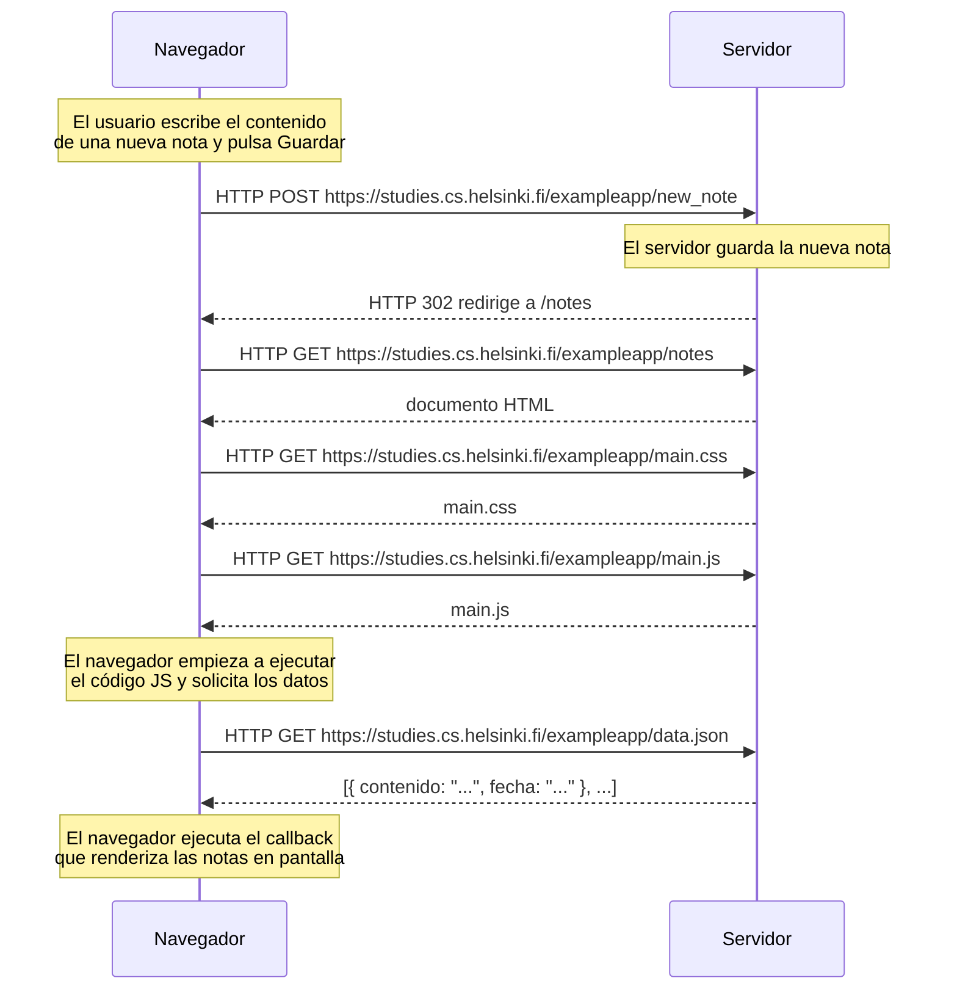

# Ejercicio 0.4: Nueva nota

Diagrama de secuencia que describe la situación en la que el usuario crea una nueva nota en `https://studies.cs.helsinki.fi/exampleapp/notes` escribiendo algo en el campo de texto y haciendo clic en el botón **Guardar**, en la versión tradicional de la aplicación.

