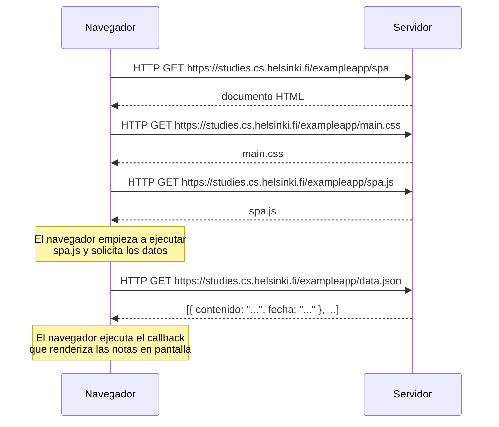

# Ejercicio 0.5: Diagrama de aplicación de una sola página

Diagrama de secuencia que describe la situación en la que el usuario accede a la versión de aplicación de una sola página (SPA) de la aplicación de notas en `https://studies.cs.helsinki.fi/exampleapp/spa`.

