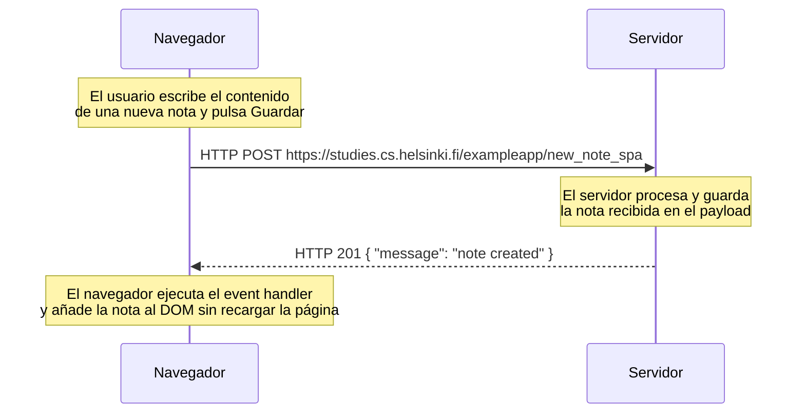

# Ejercicio 0.6: Nueva nota en diagrama de aplicación de una sola página

Diagrama de secuencia que describe la situación en la que el usuario crea una nueva nota utilizando la versión de aplicación de una sola página (SPA) de la aplicación de notas en `https://studies.cs.helsinki.fi/exampleapp/spa`.

A diferencia del ejercicio 0.4, aquí no hay recarga de página ni redirección 302: `spa.js` gestiona la creación de la nota mediante AJAX y actualiza el DOM directamente con la respuesta del servidor.

